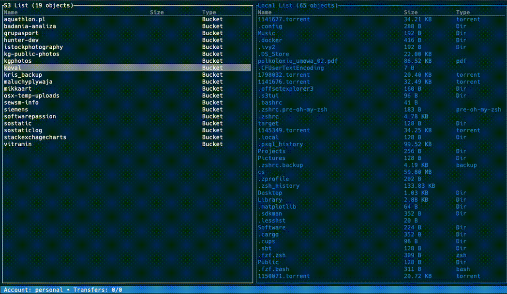

<div style="text-align: center;">

            _____ __        _ 
       ____|__  // /___  __(_)
      / ___//_  / __/ / / / / 
     (__  )__/ / /_/ /_/ / /  
    /____/____/\__/\__,_/_/

</div>
<div style="text-align: center;">

[![CI][s0]][l0] [![crates][s1]][l1] ![MIT][s2] [![UNSAFE][s3]][l3] [![LinkedIn][s6]][l6] [![dep_status][s7]][l7]

</div>

[s0]: https://github.com/softberries/s3tui/actions/workflows/rust.yml/badge.svg

[l0]: https://github.com/softberries/s3tui/actions/workflows/rust.yml

[s1]: https://img.shields.io/crates/v/s3tui.svg

[l1]: https://crates.io/crates/s3tui

[s2]: https://img.shields.io/badge/license-MIT-blue.svg

[s3]: https://img.shields.io/badge/unsafe-forbidden-success.svg

[l3]: https://github.com/rust-secure-code/safety-dance/

[s6]: https://img.shields.io/badge/LinkedIn-Connect-blue?style=flat&logo=linkedin

[l6]: https://www.linkedin.com/in/krzysztofgrajek/

[s7]: https://deps.rs/repo/github/softberries/s3tui/status.svg

[l7]: https://deps.rs/crate/s3tui

---

# s3tui - S3 Compatible Transfer CLI

`s3tui` is a ~~powerful~~ terminal-based application that enables seamless file transfers between your local machine and
multiple AWS S3 accounts. Crafted with the [ratatui](https://github.com/ratatui-org/ratatui) Rust TUI framework, `s3tui`
provides a robust user interface for managing uploads and downloads simultaneously in both directions, enhancing your
productivity with S3 services.



## Features

- **Multiple Account Support**: Easily configure and switch between different S3 accounts during runtime using the 's'
  command.
- **Simultaneous Transfers**: Transfer multiple files at once, both to and from S3, thanks to multithreading
  capabilities powered by the [tokio](https://github.com/tokio-rs/tokio) library.
- **Sortable File Lists**: Sort files by name, size, or type in both local and S3 panels using F1/F2/F3 keys.
- **Search/Filter**: Quickly filter files by name using `/` key. Search is case-insensitive and filters both panels.
- **Interactive Commands**:
    - `Tab,↔` - move between local and s3 panel
    - `s` - select account currently in use.
    - `Esc` - move back to the file manager window.
    - `↕ / j / k` - move up/down on the lists.
    - `t` - select/deselect files to transfer.
    - `c` - create bucket.
    - `⌫ / Del` - delete item.
    - `l` - Display currently selected files for transfer.
    - `r` - Execute the selected transfers.
    - `F1` - Sort by name (press again to toggle ascending/descending).
    - `F2` - Sort by size (press again to toggle ascending/descending).
    - `F3` - Sort by type (press again to toggle ascending/descending).
    - `F5` - Refresh current view.
    - `/` - Search/filter files by name (Esc to clear filter).
    - `q` - Quit the application.
    - `?` - Access the help page with all available commands.
- **Environment Configuration**: Customize settings via environment variables or utilize default settings compliant with
  the XDG Base Directory Specification.
- **Error Handling**: Integrated `color_eyre` panic hook for clear and colorized error reporting.
- **Custom Config Path**: Specify a custom credentials file path with the `--creds-file` flag, overriding the default `creds` directory lookup.
- **Version Information**: Quickly view the application version with the `--version` command.

## Setup

1. **Configure Environment Variables**:
   ```bash
    export S3TUI_CONFIG=`pwd`/.config
    export S3TUI_DATA=`pwd`/.data
    export S3TUI_LOGLEVEL=info
   ```
   Alternatively, use the default paths set according to the XDG Base Directory Specification.

   You can check your configuration by running `s3tui --version` which will show you the paths currently in use.

2. **Add your s3 credentials**
    - Add as many configurations under `creds` directory (inside your `.data` directory specified with `S3TUI_DATA` env variable)
    - The file should look like the one below:
   
```
access_key=YOUR_ACCESS_KEY
secret_key=YOUR_SECRET_KEY
default_region=eu-west-1
```
Make sure there is a new line at the end and there are no leading spaces on the lines.

### S3-Compatible Storage

s3tui supports S3-compatible storage providers. Example credential file:

```
access_key=minioadmin
secret_key=minioadmin
default_region=us-east-1
endpoint_url=http://127.0.0.1:9000
force_path_style=true
```

| Provider | endpoint_url | force_path_style |
|----------|--------------|------------------|
| [MinIO](https://min.io/) | `http://localhost:9000` | `true` |
| [RustFS](https://rustfs.com/) | `http://localhost:9000` | `true` |
| [Backblaze B2](https://www.backblaze.com/b2/) | `https://s3.us-west-000.backblazeb2.com` | `false` |
| [Wasabi](https://wasabi.com/) | `https://s3.wasabisys.com` | `false` |
| [Cloudflare R2](https://www.cloudflare.com/products/r2/) | `https://<account_id>.r2.cloudflarestorage.com` | `true` |
| [DigitalOcean Spaces](https://www.digitalocean.com/products/spaces) | `https://<region>.digitaloceanspaces.com` | `false` |

The `force_path_style` parameter controls URL formatting:
- `false` (default): Virtual-hosted style (`bucket.endpoint/key`)
- `true`: Path style (`endpoint/bucket/key`)

3. **Installation from crates.io**:
    - Ensure you have Rust and `cargo` installed.
    - Install/Upgrade with cargo
    ```bash
      cargo install s3tui
    ```
4. **Building locally**:
    - Ensure you have Rust and `cargo` installed.
    - Clone the repository and build the project:
    ```bash
      git clone <repository-url>
      cd s3tui
      cargo build --release
    ```

5. **Running s3tui**:
- Navigate to the project directory and run:
```bash
./target/release/s3tui
```
- You can also specify a custom credentials file path using the `--creds-file` flag:
```bash
s3tui --creds-file /path/to/credentials
```

## Logs

Application logs are efficiently managed and stored in the directory specified by `S3TUI_DATA`, keeping you informed of
all operations and aiding in troubleshooting.

## Getting Started

Once `s3tui` is running, press `?` to open the help page, which displays all the commands and their functions, allowing
you to start transferring files immediately.

Enhance your productivity with `s3tui`, the command-line interface that bridges the gap between local file management
and cloud storage with ease and efficiency. Whether you're managing large datasets or performing routine
backups, `s3tui` makes S3 file transfer tasks intuitive and manageable directly from your terminal.

## Development

### Building

```bash
# Debug build
cargo build

# Release build
cargo build --release

# Run directly
cargo run
```

### Testing

```bash
# Run unit tests
cargo test

# Run property-based tests
cargo test --test property_tests

# Run all tests including integration tests (requires Docker)
cargo test -- --include-ignored

# Run only integration tests (requires Docker)
cargo test --test s3_compat_tests -- --ignored

# Run a specific test
cargo test test_name

# Run benchmarks
cargo bench
```

Integration tests use [testcontainers](https://github.com/testcontainers/testcontainers-rs) to spin up MinIO containers automatically. Make sure Docker is running before executing integration tests.

Benchmarks use [criterion](https://github.com/bheisler/criterion.rs) for performance measurement.

### Code Quality

```bash
# Run linter
cargo clippy

# Format code
cargo fmt

# Check formatting without changes
cargo fmt -- --check
```

## Contributing

Contributions are welcome! Here's how you can help:

1. **Fork the repository** and create your branch from `main`
2. **Make your changes** and ensure tests pass
3. **Run the linter** (`cargo clippy`) and fix any warnings
4. **Format your code** (`cargo fmt`)
5. **Submit a pull request** with a clear description of your changes

### Guidelines

- Follow Rust idioms and best practices
- Add tests for new functionality
- Update documentation as needed
- Keep commits focused and atomic
- Use descriptive commit messages

### Reporting Issues

Found a bug or have a feature request? Please [open an issue](https://github.com/softberries/s3tui/issues) with:
- A clear description of the problem or feature
- Steps to reproduce (for bugs)
- Your environment (OS, Rust version, s3tui version)

## License

This project is licensed under the MIT License - see the [LICENSE](LICENSE) file for details.
