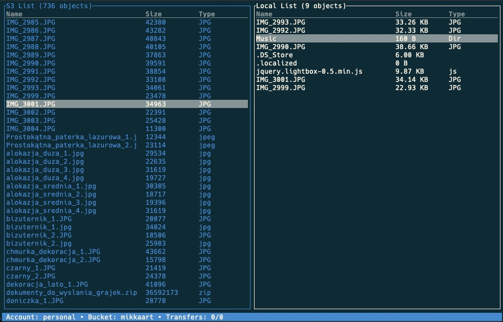

[](https://github.com/softberries/s3tui/actions/workflows/rust.yml)
# s3tui (WIP)

### Simple S3 CLI client for file transfers and more

This is a simple TUI S3 client and serves mostly as a learing resource for my Rust journey. Most of the code is in the prototyping statge as I'm looking for best solutions and quickest ones interchangably. Use at your own risk.




## Setup

Add at least one configuration file under your `$HOME/.s3tui/creds` directory with the format like:
```text
access_key=YOUR_S3_ACCESS_KEY
secret_key=YOUR_S3_SECRET_ACCESS_KEY
default_region=AWS_REGION_NAME
```
Name the file as you wish, save and quit.

## Usage
Press `?` for available commands, and `q` to quit.
